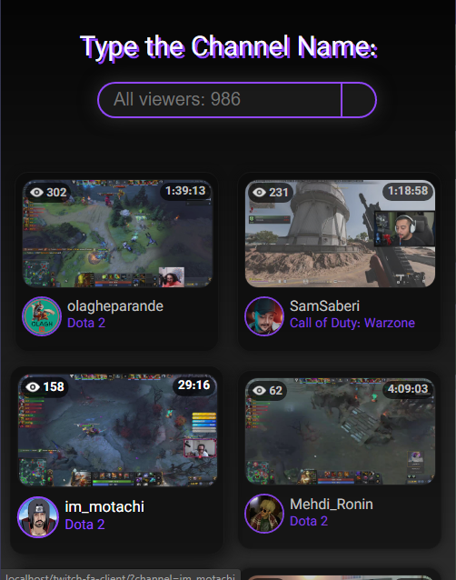
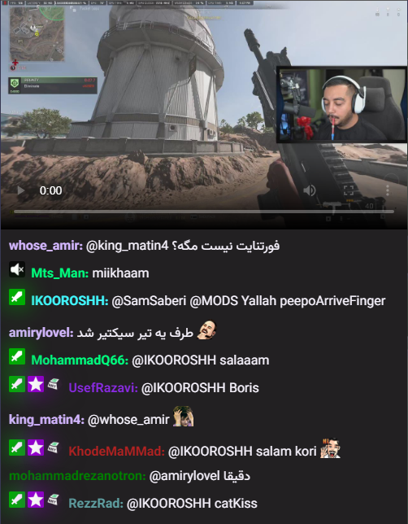
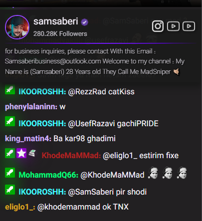

# TwitchFa Chat

## Description
A bridge for Iranians who are restricted to access `twitch.tv`.
a COMPLETE frontend webapp (kinda)

- The stream player is for android browser (tested in android 12, idk if it works on lower version of androids) howewer, the chat completely support all browsers.

## TODO List
1. Get app working perfectly fine in desktop (see stream in desktop)
2. Adding sub-gifter badge[.](https://www.google.com/search?q=sub+gifter+twitch+badge&tbm=isch#imgrc=bWzoPFdZVHiHcM)

## Built with
* JavaScript
* tmi.js

## Screenshots

## Contributes
[**xMetaneRx**](https://github.com/xMetaneRx)
[(Repo)](https://github.com/xMetaneRx/twitch-chat)
\
[**Ali Khalilifar**](https://github.com/alikhalilifar)
[(Repo)](https://github.com/alikhalilifar/persian-twitch-client)
