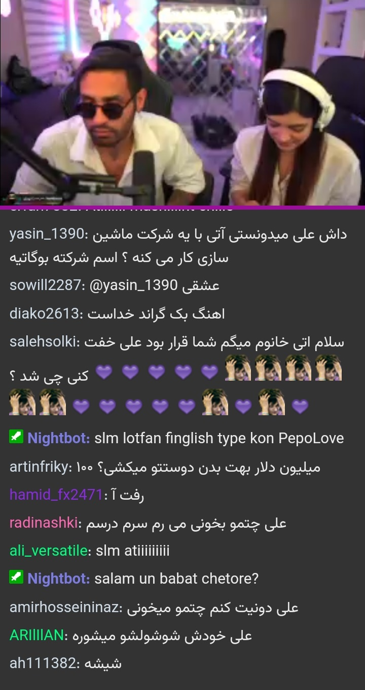

# TwitchFa Chat

## Description
A bridge for Iranians who are restricted to access `twitch.tv`.

- The stream player is for android browser (tested in android 12, idk if it works on lower version of androids)

## TODO List
1. Set default quality. when page is loaded, play the stream automatically
2. Design a custom controler (the functions kinda ready, `playStream()` and `muteStream()`)
3. Send chat (maybe never added, because it require loging in or enter api code or something)
4. Get app working perfectly fine in desktop
5. Fix the viewer's text (in short usernames)
6. Add OnClick thing for explore to go to stream directly without enterong something

## Built with
* JavaScript
* tmi.js

## Screenshots

## Contributes
[**xMetaneRx**](https://github.com/xMetaneRx)
[(Repo)](https://github.com/xMetaneRx/twitch-chat)
\
[**Ali Khalilifar**](https://github.com/alikhalilifar)
[(Repo)](https://github.com/alikhalilifar/persian-twitch-client)
